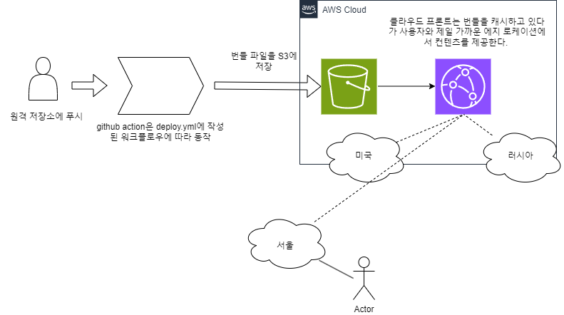

# 프론트엔드 CI/CD 파이프라인
## 개요

### 파이프 라인 설명
저장소에 푸시를 하면, 다음과 같이 GitHub Actions 워크플로우에 따라 배포가 진행된다.

1. 저장소를 체크아웃한다.
2. Node.js 18.x 버전을 설정한다.
3. 프로젝트 의존성을 설치한다.
4. Next.js 프로젝트를 빌드한다.
5. AWS 자격 증명을 구성한다.
6. 빌드된 파일을 S3 버킷에 동기화한다.
7. CloudFront 캐시를 무효화한다. (캐시 무효화를 하지 않으면 사용자는 새로운 배포가 있음에도 캐시된, 이전 버전을 보게 된다.)

## 주요 링크

- S3 버킷 웹사이트 엔드포인트: http://juhong-bucket.s3-website-ap-southeast-2.amazonaws.com/
- CloudFrount 배포 도메인 이름: https://d2fzzrc0svgnb.cloudfront.net
